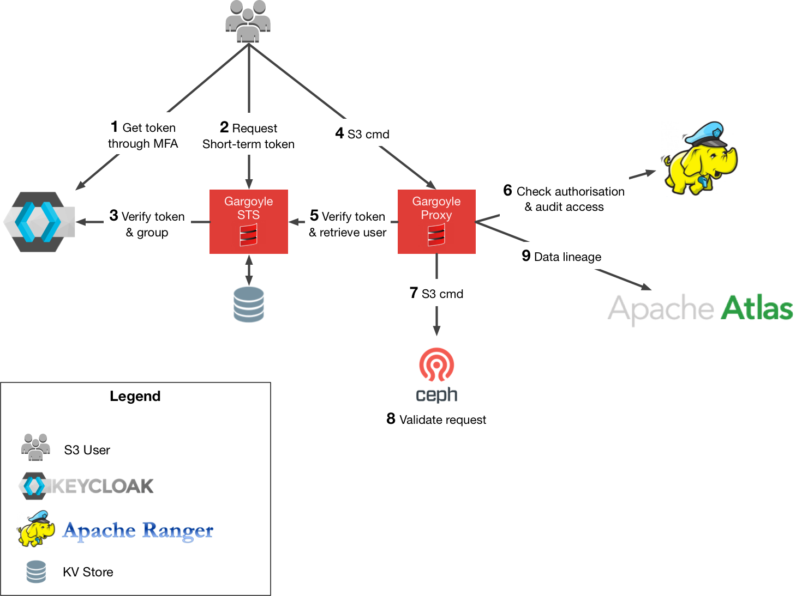

# What is Rokku?

Rokku is a security layer on top of an S3 interface. It ensures authentication and authorisation for any S3 capable
storage solution. It is originally developed to provide blob storage security for a Data Analytics Platform (DAP).

## Why

We're using CEPH as the distributed storage solution for their Big Data platform. Using Rados Gateways
CEPH provides an S3 interface allowing any S3 compatible solution to use it. Unfortunately at the time of writing the
security features CEPH provides are insufficient for our team. Things we found lacking were:

- Multi-factor authentication
- Easy authorisation management to buckets/objects
- Short term access rights to resources to reduce risk on leaked credentials
- Proper audit logging and lineage support

## How

Rokku filters and proxies requests to the S3 Api and implements part of the AWS IAM/STS api. This allows for 
interoperability with existing tools that support S3. We make use of the following services:

- Keycloak for Multi-factor authentication
- Apache Ranger for authorisation
- Apache Atlas for data lineage

Rokku exists of the following services and capabilities:

- STS. The Security Token Service (STS) is a web service that enables you to request temporary, limited-privilege 
credentials for AWS Identity and Access Management (IAM) users or for users that you authenticate. The following 
endpoint calls should be supported.
    1. `get_session_token` Returns a set of temporary credentials for an AWS account or IAM user. The credentials consist of an access key ID, a secret access key, and a security token.
    2. `assume_role` Returns a set of temporary security credentials (consisting of an access key ID, a secret access key, and a security token) that you can use to access AWS resources that you might not normally have access to.
- S3 Gateway. A filter proxy that adds extra capabilities to the standard S3 capabilities that DAP already offers: external Policy checking through Apache Ranger, Apache Atlas for lineage and Bucket notifications.

### Architecture

This results in the following architecture picture:

1. **User** goes to Keycloak and is requested to authenticate him/herself using MFA.
2. **User** requests a short term token with the Rokku STS service for the type of access he requires to S3 (e.g. 
assume a certain role or access to his own resources). This request includes the token received from Keycloak. 

3. **Rokku STS** verifies the token with Keycloak and potentially verifies whether a user is allowed to 
assume a certain role. If verified it returns a new short term token to the user.
4. **User** sends the request to the Rokku proxy with the STS token.
5. **Rokku Proxy** verifies the STS token with Rokku STS and retrieves the user corresponding to the AWS 
credentials.
6. **Rokku Proxy** verifies authorisation of the request with Apache Ranger and writes audit log to Apache Ranger.
7. **Rokku Proxy** passes through the request to CEPH if the STS and Apache Ranger checks both succeeded.
    >If needed the proxy will automatically create the user on CEPH using the user info from the STS service.
    This user will only have rights for his own buckets initially, and should stil manually be made a system user to 
    access other buckets he has rights for in Apache Ranger.
8. **CEPH** validates the request to ensure it hasn't been tampered with.
9. **Rokku Proxy** logs lineage data with Apache Atlas.

### Technologies

The Rokku project is written entirely in Scala 2.12.8.

To be determined:
- KV store
